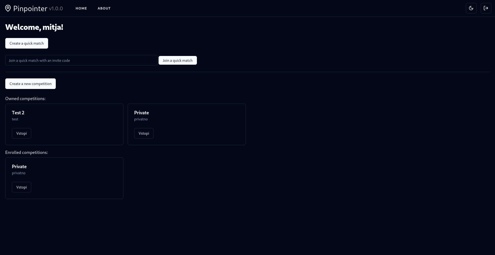
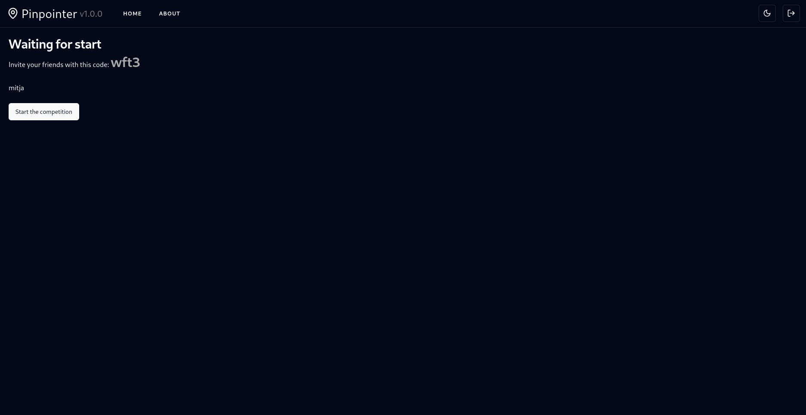
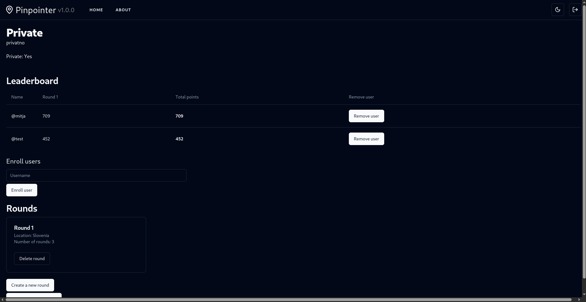

# Pinpointer
Pinpointer, a system for organization of geoguessing contests.

# Screenshots

### Main page


### Quick game waiting lobby


### In-game display


### Competition overview


# Deployment
Docker images are automatically built by GitHub Actions.

`docker-compose.yml`, similar to the following should suffice for most common uses:

```yaml
services:
  backend:
    image: ghcr.io/mytja/pinpointer
    environment:
      - TZ=Europe/Ljubljana
      - PUBLIC_GOOGLE_MAPS_SDK_KEY=${PUBLIC_GOOGLE_MAPS_SDK_KEY}
      - GOOGLE_MAPS_SDK_KEY=${GOOGLE_MAPS_SDK_KEY}
      - PUBLIC_GOOGLE_MAPS_MARKER_MAP_ID=${PUBLIC_GOOGLE_MAPS_MARKER_MAP_ID}
      - DATABASE_URL=${DATABASE_URL}
    restart: always
    networks:
      pinpointer:
        aliases:
          - backend
    ports:
      - 127.0.0.1:6329:3000
    extra_hosts:
      - "host.docker.internal:host-gateway"
networks:
  pinpointer:
```

Make sure to create a `.env` file with required environment variables.
Pinpointer Docker container depends on having Postgres deployed on host computer.
The `docker-compose.yml` file can certainly be modified in order to have a containerized database.

# License
AGPLv3

Refer to the [LICENSE](LICENSE) file.
